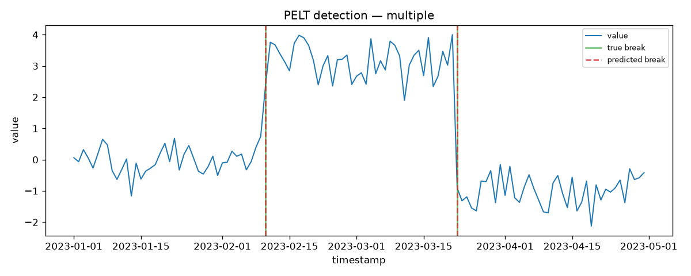
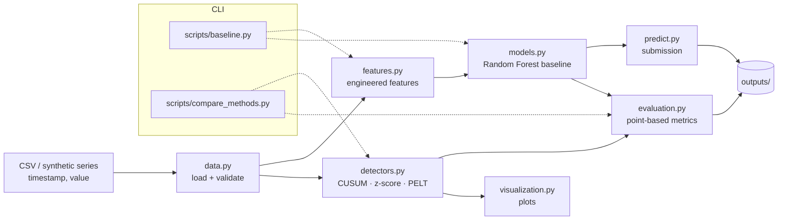

# Structural Break Detection

[](https://github.com/WolfpackOfOne/structural-break/actions/workflows/ci.yml)
[](LICENSE)
[](https://www.python.org/)

> Detecting regime shifts and structural breaks in time-series data using
> statistical change-point methods and machine-learning baselines.

Structural breaks are abrupt changes in the data-generating process of a time
series. In finance and economics they show up as **regime shifts, market-stress
periods, volatility transitions, model instability, and changing relationships
between variables** — exactly the moments risk and quant teams most need to catch.

This repository contains a machine-learning baseline plus a set of classical and
modern change-point detectors (CUSUM, rolling z-score, PELT), all behind a small,
tested Python package. It was built around the ADIA Lab Structural Break Challenge
hosted by CrunchDAO, and now also targets the **Real-Time Edition** of that
challenge (see below).



*PELT recovering both break points on a synthetic three-regime series. Green lines
mark the true breaks; red dashes mark the predicted breaks. Reproduce with
`python scripts/compare_methods.py --dataset multiple --figure out.png`.*

### Why structural breaks matter

When a market regime changes, models trained on the old regime quietly degrade,
risk estimates drift, and relationships that held for years stop holding. Detecting
*where* and *when* the data-generating process changes is foundational to risk
management, macro-regime analysis, and robust financial machine learning. This
project is a compact, reproducible reference for how to approach that problem — from
a competition baseline to a maintainable research workflow.

### Documentation

- [Methodology](docs/methodology.md) — what a structural break is and how each detector works.
- [Data note](docs/data.md) — challenge context, schema, and what is / isn't included.
- [Contributing](CONTRIBUTING.md) — setup, checks, and conventions.

## Real-Time Edition

The [ADIA Lab Structural Break Challenge: Real-Time Edition](https://hub.crunchdao.com/competitions/structural-break-real-time)
is a distinct, newer CrunchDAO competition, meaningfully different from the
original challenge the rest of this repository targets:

| | Original challenge | Real-Time Edition |
| - | - | - |
| Break location | Known boundary point | Unknown, anywhere in the online segment (or absent) |
| Output | One score per series | One score **per online time step** |
| `infer()` shape | Batch over a list of DataFrames | Streaming generator, one point at a time, **iterable only once** |
| Metric | ROC AUC | Time-Stratified AUC (cross-sectional AUC at each step, weighted average) |

Each series has a break-free **historical segment** (1,000–5,000 observations)
followed by an **online segment** (10–1,000 observations) revealed one point at
a time; the submission must yield one score in `[0, 1]` per online observation,
in order, without ever revisiting a previous point.

**What's here:**

- `src/structural_break/realtime.py` — a tested, importable `StreamingBreakDetector`
  (EWMA z-score + two-sided CUSUM + EWMA variance-ratio, combined via a noisy-OR),
  plus the `train`/`infer` entry points, a local `time_stratified_auc` implementation
  of the official metric, and synthetic-data generators for the `(id, x_historical,
  x_online, tau)` tuple format this challenge uses.
- `tests/test_realtime.py` — unit tests against synthetic data (mean shifts, variance
  shifts, no-break series, degenerate inputs, and a `train()`/`infer()` round trip).
- `scripts/realtime_baseline.py` — CLI to evaluate the detector on synthetic data
  and print the Time-Stratified AUC:

  ```bash
  python scripts/realtime_baseline.py --n-series 40 --seed 0
  ```

- `realtime_submission.ipynb` — the **actual submission notebook**. It embeds the
  same detector logic inline (self-contained — the CrunchDAO runner only sees this
  notebook, not the rest of the repo) in the format the platform expects. To submit:

  1. Open the notebook (locally, in Jupyter, or in Colab).
  2. Get your personal setup command/token from
     https://hub.crunchdao.com/competitions/structural-break-real-time/submit/notebook
     (requires login — this is tied to your account and can't be automated on your behalf).
  3. Run `crunch setup-notebook structural-break-real-time <your-token>` to pull the
     real competition data locally.
  4. Run the notebook top to bottom; `crunch_tools.test()` reproduces the cloud
     evaluation flow locally and reports a local Time-Stratified AUC.
  5. Submit via `crunch push` (CLI) or `crunch_tools.submit(...)` (Colab only), then
     create a run on the competition page to validate against the full test set.

  No official competition data is bundled here (same licensing restriction as the
  original challenge) — the notebook downloads it via `crunch setup-notebook` using
  your token.

## Current status

This is an active research project. Implemented today:

- A supervised baseline: engineered time-series features + a Random Forest classifier.
- Statistical / change-point detectors on a shared interface: **CUSUM**, **rolling z-score**, and **PELT** (via `ruptures`).
- Synthetic data generators with known break points, a method-comparison workflow, and a plotting helper.
- An importable package under `src/structural_break/`, a pytest suite, and GitHub Actions CI.

Planned upgrades (see [Roadmap](#roadmap)):

- HMM regime detection and Bai-Perron-style multiple-break tests.
- Experiment tracking and richer visual diagnostics.
- A notebook walkthrough on the official challenge data.

## Repository layout

```text
structural-break/
├── src/
│   └── structural_break/   # Importable package
│       ├── data.py         # CSV loading + column validation
│       ├── features.py     # Baseline feature engineering
│       ├── models.py       # scikit-learn pipeline builder
│       ├── detectors.py    # CUSUM / rolling z-score / PELT detectors
│       ├── synthetic.py    # Synthetic series with known break points
│       ├── evaluation.py   # Per-row + point-based metrics
│       ├── visualization.py# Optional plotting helper
│       ├── predict.py      # Submission/prediction helpers
│       └── realtime.py     # Real-Time Edition: streaming detector + train/infer
├── scripts/
│   ├── baseline.py         # Thin argparse CLI around the package
│   ├── compare_methods.py  # Detector comparison workflow (synthetic data)
│   └── realtime_baseline.py# Real-Time streaming detector vs. synthetic data (TS-AUC)
├── data/                   # Small synthetic sample data (see data/README.md); raw files stay untracked
│   ├── train.csv
│   ├── test.csv
│   └── README.md
├── outputs/                # Generated predictions; created at runtime and git-ignored
├── baseline.ipynb          # Original-challenge quickstarter notebook (requires crunch-cli)
├── realtime_submission.ipynb # Real-Time Edition submission notebook (requires crunch-cli)
├── pyproject.toml          # Package metadata / build configuration
├── requirements.txt        # Python dependencies
├── LICENSE                 # MIT license
└── README.md
```

> Note: The repository previously included local virtual environment files. New virtual environments should be created locally and left untracked.

## Architecture

The package separates data handling, modelling, and evaluation; two thin CLI
scripts wire them into runnable workflows.



## Setup

Clone the repository:

```bash
git clone https://github.com/WolfpackOfOne/structural-break.git
cd structural-break
```

Create and activate a virtual environment:

```bash
python -m venv .venv
source .venv/bin/activate  # macOS/Linux
# .venv\Scripts\activate   # Windows PowerShell
```

Install dependencies:

```bash
pip install -r requirements.txt
```

Optionally, install the package itself (editable) so you can `import structural_break`
from anywhere:

```bash
pip install -e .
```

## Data

The repository ships with **small synthetic sample data** under `data/` so the
baseline runs immediately after cloning — no downloads required. These samples
each contain one ordered series with a single injected structural break and are
**not** the official challenge data. See [`data/README.md`](data/README.md) for
the schema and details.

The baseline expects the following columns:

- `timestamp`
- `value`
- `has_structural_break` in the training data

This project was built around the ADIA Lab Structural Break Challenge hosted by
CrunchDAO. The official competition data is **not redistributed** here. To run
against it, place the real files at `data/train.csv` / `data/test.csv`
(replacing the samples) or keep large raw files under the git-ignored
`data/raw/`.

## Run the baseline

The baseline is a thin CLI around the `structural_break` package. Run it from the
repository root:

```bash
python scripts/baseline.py \
  --train data/train.csv \
  --test data/test.csv \
  --output outputs/submission.csv
```

All three paths default to the values shown above, so `python scripts/baseline.py`
works out of the box against the bundled synthetic samples. The command engineers
baseline features, trains a Random Forest classifier, prints training metrics, and
writes a submission CSV with `timestamp` and `has_structural_break` columns. Missing
files or missing columns are reported with a clear error message and a non-zero exit
code.

To use the package directly:

```python
from structural_break import (
    create_baseline_features,
    build_random_forest_baseline,
    build_submission,
)
```

## Development

Install the development dependencies (runtime requirements plus `pytest` and `ruff`)
and run the checks locally:

```bash
pip install -r requirements-dev.txt
pip install -e .

ruff check .   # lint
pytest         # tests (synthetic data only — no competition data required)
```

The same two commands run in [GitHub Actions](.github/workflows/ci.yml) on every
push to `main` and every pull request.

## Methods

The project pairs a supervised ML baseline with classical/modern change-point
detectors. Every detector shares one interface — `detector.detect(df)` returns a
DataFrame with `timestamp`, `break_score`, `has_structural_break`, and `method`:

```python
from structural_break import CusumDetector, PeltDetector, RollingZScoreDetector

result = PeltDetector().detect(df)   # df has 'timestamp' and 'value' columns
```

| Method | Detects | Strength | Limitation |
| ------ | ------- | -------- | ---------- |
| ML baseline (Random Forest) | Per-row break label from engineered features | Learns from labelled data | Needs labels; not a true change-point model |
| CUSUM | A single dominant mean shift | Simple, interpretable, parameter-light | Finds only the strongest break; mean-only |
| Rolling z-score | Local deviations / transitions / outliers | Transparent, no training | Flags transition points, not whole regimes |
| PELT (`ruptures`) | One or more mean shifts (penalised segmentation) | Handles multiple breaks well | Penalty tuning; mean-shift focused (`l2`) |

The **ML baseline** engineers `rolling_mean_3`, `rolling_std_3`, `lag_1`, `lag_2`,
`diff_1`, and `diff_2` from the `value` column and fits a `StandardScaler` +
`RandomForestClassifier` pipeline. Each detector documents its scoring and break
semantics in its class docstring in `src/structural_break/detectors.py`.

### Compare methods

`scripts/compare_methods.py` runs all detectors on a synthetic series with known
break points and scores each with windowed point-based precision/recall/F1:

```bash
python scripts/compare_methods.py \
  --dataset mean_shift \
  --output outputs/method_comparison.csv \
  --figure outputs/figures/example_break_detection.png
```

`--dataset` accepts `mean_shift`, `multiple`, or `variance`.

### Results (synthetic)

The numbers below are computed by the command above on the **synthetic**
`mean_shift` dataset (single mean shift at index 60, tolerance ±5). They are not
official competition results — they demonstrate detector behaviour on data with a
known ground truth.

| Method | Precision | Recall | F1 | Notes |
| ------ | --------: | -----: | -: | ----- |
| CUSUM | 1.00 | 1.00 | 1.00 | Single dominant mean shift |
| Rolling z-score | 1.00 | 1.00 | 1.00 | Flags the transition |
| PELT | 1.00 | 1.00 | 1.00 | Penalised segmentation |
| ML baseline | 1.00 | 1.00 | 1.00 | Trained on an independent series |

On harder cases the tradeoffs show: on the `multiple` dataset CUSUM recovers only
the dominant break (recall 0.5) while PELT recovers both; on the `variance`
dataset the mean-based detectors miss the volatility shift that the rolling
z-score still flags. Results against the official ADIA Lab challenge data are
**pending** and will be reported only when reproducible.

## Roadmap

**Done**

- [x] Repository hygiene and a reproducible baseline (Phase 1).
- [x] Refactor into an importable `src/structural_break/` package (Phase 2).
- [x] pytest suite + Ruff + GitHub Actions CI (Phase 3).
- [x] Change-point detectors — CUSUM, rolling z-score, PELT — with synthetic
      datasets, a comparison workflow, and visualization (Phase 4).

**Planned**

- [ ] HMM regime detection.
- [ ] Bai-Perron-style multiple-break test (or a `statsmodels` approximation).
- [ ] Bayesian / online change-point detection.
- [ ] Experiment tracking and a results dashboard.
- [ ] Richer visual diagnostics (score overlays, multi-method comparison plots).
- [ ] A notebook walkthrough on the official challenge data.

## Suggested GitHub topics

`time-series` · `structural-breaks` · `change-point-detection` · `quant-finance` ·
`machine-learning` · `python` · `scikit-learn`

## License

This project is licensed under the MIT License. See [LICENSE](LICENSE) for details.
