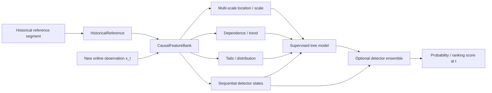

# ADIA Lab Structural-Break Challenge: From the 2025 Winning Playbook to a Competitive 2026 Real-Time System

## Executive summary

The central conclusion of this review is straightforward: **your current 2026 implementation has a sound causal streaming skeleton, but it leaves most of the competitive advantage demonstrated by the 2025 leaders unused—especially the new 2026 supervision.** The most important next step is not to reproduce thousands of 2025 offline features. It is to convert the best *families* of those features into a compact causal, multi-scale streaming representation and then **learn how to combine them from the exact 2026 break-position labels**.

The change in problem formulation is fundamental. In 2025, competitors saw the complete time series and a known candidate boundary, then returned one probability that a break occurred at that boundary; scoring was ordinary ROC AUC. citeturn33search2 In 2026, the historical reference segment is visible up front, but the online portion arrives one observation at a time. A break can occur anywhere or never, and a score must be emitted after every observation without look-ahead. citeturn33search0turn33search3 The organizer further states that the 2026 training labels contain **exact break positions**, explicitly supporting supervised learning on `(series, time step)` examples. citeturn33search3

That last point is the largest gap in the present branch. In `src/structural_break/realtime.py`, `train()` deliberately discards `datasets` and saves only four fixed hyperparameters. The online detector then manually combines an EWMA mean statistic, a two-sided CUSUM, and an EWMA second-moment/variance-ratio statistic. fileciteturn7file0L2-L2 The submission notebook does the same: its training loop is effectively empty and persists the defaults rather than learning from `tau`. fileciteturn10file0L2-L2 **The competition is giving you exact timing labels, and the current solution is not using them.**

The 2025 evidence is remarkably consistent. Alphabot's first-place solution used independent, highly diverse feature pipelines, eight first-level tree models, bagging, and a second-level stack; its features covered classical tests, distribution distances, autocorrelation, tails, cumulative paths, trend, entropy, nonlinear interactions, wavelets and many window scales. fileciteturn0file0 Farukcan Saglam's second-place solution generated 2,408 transformed/windowed features, used TabPFN out-of-fold predictions as an additional signal, selected features with SHAP/LightGBM importance and finished with LightGBM. citeturn33search12 Inni Dynamics concentrated on before/after ratios, local windows, distribution/dispersion measures and CatBoost, finishing at 88.34% OOS. citeturn33search11 Secabird similarly covered local windows, nonparametric tests, variance dynamics, Hurst, wavelets, entropy, autoregression and tree boosters. citeturn25view0

The transferable lesson is therefore **feature diversity plus learned nonlinear combination**, not “copy the 2025 feature count.” In the real-time setting, symmetric pre/post windows, full post-segment statistics and boundary-alignment features are illegal or impossible, but most high-value families have causal analogues: historical-versus-recent ratios, multi-scale EWMAs, rolling quantile/tail rates, online ACF changes, recursive slopes, histogram divergences, causal wavelet/filter energy, sequential likelihood statistics and online change-point probabilities.

My highest-priority design would be:



A **LightGBM or CatBoost model over perhaps tens to low hundreds of carefully chosen causal features** is a much better first target than immediately rebuilding Alphabot's thousands of offline interactions. The 2026 organizer explicitly emphasizes incremental approaches because evaluation spans more than 10,000 series and up to 1,000 online observations per series under a reported 15-hour weekly compute budget. citeturn33search3

There are also several correctness and validation issues worth fixing before extensive feature work. Your synthetic generator currently models only iid Gaussian mean and variance changes; therefore the tests demonstrate that the detector works on the two break mechanisms it was explicitly designed to detect, not that it generalizes to the heterogeneous DGPs described by the challenge. fileciteturn7file0L2-L2 fileciteturn8file0L2-L2 The 2025 documentation says challenge series cover different real-world-style processes and breaks can include abrupt or smooth parameter, functional-form and regime changes. citeturn33search2

One more high-priority item is **metric parity**. Your local `time_stratified_auc()` computes cross-sectional AUC at each online index and weights it by `n_positive × n_negative`. fileciteturn7file0L2-L2 The organizer's public 2026 description confirms per-step AUC followed by a weighted average, but the public material I could retrieve does not specify that exact pair-count weighting formula. citeturn33search3 Before using that local function as the objective for model selection, I would verify it byte-for-byte or numerically against the current Crunch quickstarter scorer.

In priority order, the work I expect to matter most is therefore:

**official-metric parity → causal training-data builder with series-level CV → multi-scale causal feature bank → supervised booster → dependence/trend/tail/distribution features → calibrated detector ensemble → only then expensive wavelet/entropy/BOCPD/stacking experiments.**

That sequence captures the strongest 2025 lessons while respecting the much harder causal structure of 2026.

## Challenge evolution and scoring implications

The 2025 and 2026 competitions should be treated as related scientific problems but **different statistical learning tasks**.

| Dimension | 2025 Structural Break Challenge | 2026 Real-Time Edition | Consequence for your design |
|---|---|---|---|
| Information at prediction time | Entire time series plus known candidate boundary. citeturn33search2 | Historical reference initially; online data revealed one point at a time. citeturn33search0 | Most symmetric pre/post features become illegal. |
| Break location | Candidate boundary explicitly given. citeturn33search2 | Unknown; can occur at any online point or not at all. citeturn33search0 | Model must detect *where* as well as *whether*. |
| Output | One score per series. citeturn33search2 | One score after every online observation. citeturn33search3 | Detection latency now affects many scored observations. |
| Metric | Ordinary ROC AUC across series. citeturn33search2 | Time-Stratified AUC: cross-sectional AUC at each step, then weighted average. citeturn33search3 | Relative ranking against other live series at the *same time* is what matters. |
| Training supervision | Series-level break/no-break label at known boundary. citeturn33search2 | Exact break positions are provided; supervised `(series,time)` training is explicitly supported. citeturn33search3 | A major opportunity for a learned sequential classifier. |
| Typical size | 10,000 train and 10,000-series public/private sets; approximately 1,000–5,000 observations. citeturn33search2 | 10,000+ univariate series per split; online horizon may reach 1,000 points according to organizer launch material. citeturn33search0turn33search3 | Incremental O(K) feature updates are practical; full recomputation is not. |
| Look-ahead | Full post-boundary segment was legitimately available. citeturn33search2 | Explicitly prohibited. citeturn33search0turn33search3 | Every feature must be prefix-invariant. |
| Compute | 2025 docs specified a 15-hour maximum over the full evaluation. citeturn33search2 | Organizer launch material reports a 15-hour weekly budget. citeturn33search3 | Streaming sufficient statistics are highly attractive. |
| Official 2026 calendar | N/A | Current ADIA Lab page gives **May 6–September 17**, with winners at the October 26–28 symposium. citeturn33search0 | Treat the current ADIA page as authoritative over earlier promotional dates. |

There is an archival date inconsistency worth recording rather than silently resolving. The current official ADIA retrospective says the 2025 competition ran May 14–September 15, while the Crunch documentation lists September 30 as the end date. citeturn33search5turn33search2 Likewise, an early 2026 Crunch promotional post said May 4–September 15, whereas the current ADIA page and newer Crunch posts give May 6–September 17. citeturn33search3turn33search0turn33search6 For current planning, **September 17 is the date I would use**.

### What Time-Stratified AUC changes

The metric has a subtle but important modeling consequence. Because ordinary AUC is evaluated **cross-sectionally among series at a fixed online step**, a feature that is purely a deterministic function of `t` is constant for every surviving series in that stratum and therefore cannot change their ordering. citeturn33search3 Time can still matter through interactions—for example, the statistical reliability of a variance ratio after 5 observations is different from after 100—but a bare “current step” feature cannot by itself improve within-step AUC.

That is also why the final online horizon should not be used. Crunch has explicitly said that `x_online` is a generator whose final length is intentionally unavailable; in a genuine stream, the endpoint is not known in advance, and exploiting it would violate the intended setup. citeturn19view3 A feature such as `t / final_online_length` should therefore be treated as forbidden. `t`, historical length, and statistics of the observed prefix are legitimate.

The scoring structure also argues against optimizing only a conventional row-wise validation AUC. Imagine converting each series into hundreds of prefix rows and randomly splitting those rows: almost identical states from the same series would land in both train and validation. That would badly inflate performance. Validation must hold out **entire series**, then reconstruct the competition metric across the held-out streaming trajectories.

The ideal validation hierarchy is therefore:

\[
\text{training series}
\;\longrightarrow\;
\text{causal prefix features}
\;\longrightarrow\;
\text{GroupKFold by series}
\;\longrightarrow\;
\text{full held-out trajectories}
\;\longrightarrow\;
\text{official TS-AUC}.
\]

This is more important than whether the first supervised model is LightGBM, CatBoost or another tabular learner.

## What the 2025 leaders actually did

The strongest commonality across the accessible 2025 solutions is that they **recast change-point detection as rich tabular classification**. They did not rely on one classical test. They generated many imperfect views of a possible break and let nonlinear tree models learn which combinations mattered.

### Comparative solution table

| 2025 source | Main feature families | Transforms and window scales | Tests / divergences | Models and ensemble | Validation evidence | Reported OOS |
|---|---|---|---|---|---|---:|
| **Alphabot — first place** fileciteturn0file0 | Location/scale; quantiles; entropy; tail occupancy; CV; slopes; cumulative-path geometry; ACF/PACF; risk metrics; distribution distances; wavelets; nonlinear feature interactions. | Raw, absolute, `log(1+x)`, cumsum, cumprod, pct-change, IQR-filtered and sign variants, Symlet-2 wavelet. Windows include 20–240, 50/100/200/250/1000, full regimes and central/core slices. | Welch t, F variance, Fligner-Killeen, Wilcoxon, KS, BDS, CUSUMSQ, sup-F, two-proportion tests; JSD, Hellinger, Wasserstein, Canberra, Bray-Curtis and others. | Eight first-level XGBoost/RF models; one five-seed bagged model; predictions fed into second-level model plus João's meta-features. Final meta representation ≈100 features. | PDF emphasizes independently developed pipelines and leakage-safe stacking; exact fold construction is not disclosed. | **90.14%** private/OOS. citeturn27search1 |
| **Farukcan Saglam / aParsecFromFuture — second** citeturn33search12 | Descriptive moments, quantiles, ACF, transformed statistics, window contrasts and statistical tests; 2,408 initial features. | Z-score, cumsum, dense rank, absolute value, moving mean/std; code uses multi-scale windows including 20, 60, 120, 500 and 1,000, with rolling transforms. fileciteturn5file1 | F-test, Levene, KS among the explicit test families. | Five TabPFN models generate OOF/meta prediction; SHAP and LightGBM importance select feature subsets; final LightGBM. fileciteturn5file1 | Five-fold shuffled KFold across **series** in the 2025 formulation; OOF TabPFN prediction used downstream. fileciteturn5file1 | **89.85%**. citeturn27search1 |
| **Inni Dynamics / Tuah Jihan — seventh** citeturn33search11turn25view2turn26view0 | Level, volatility, trend, distribution shape; dispersion; Gini/Theil; entropy/complexity; spectral/periodicity; quantile/tail; local vs global ratios. | Raw, absolute and cumulative views; whole series and boundary fractions, including experiments around 10%, 30%, 60%; strong emphasis on after/before ratios. | Levene, Mann–Whitney, Bartlett, Fligner; Bhattacharyya and other distribution-shift measures; ADF among stationarity-related signals. | CatBoost over thousands of engineered features; no published second-level stack in the accessible solution. | Public write-up discusses iterative window/feature experiments but does not disclose an exact fold scheme. | **88.34%**. citeturn33search11 |
| **secabird** citeturn25view0 | Moments, rolling statistics, ACF, trend, variance dynamics, Hurst, energy, wavelets, entropy, AR coefficients, tsfresh features. | Full pre/post and return-like views; local ±7, ±15, ±30, ±100 windows; sliding variance windows of 100 with step 50; db4 wavelets; AR(5). | Levene, KS, Anderson–Darling, Cramér–von Mises, Mood median, Fligner-Killeen; energy statistic. | CatBoost, LightGBM and XGBoost reported as strongest families. | Exact CV and final blend are not disclosed in the accessible repository description. | Not stated in accessible source. |
| **Crunch organizer spotlight: Guoqin Gu & Mutian Hong — fifth** | Raw/cumulative/differenced representations, broad feature categories, cross-period ratios/contributions and large interaction screening. citeturn32search8 | Raw, cumsum and difference views; very large candidate interaction search. citeturn32search8 | Statistical comparison families are part of the feature pipeline; published spotlight emphasizes feature selection rather than a single test. citeturn32search8 | LightGBM + XGBoost + CatBoost ensemble after feature importance/correlation/permutation selection. citeturn32search8 | Organizer spotlight reports large-scale interaction selection; exact private-CV construction was not exposed in the indexed material. | **89.28%** final OOS. citeturn27search1 |
| **Provided Notion page** | *Could not be retrieved reliably from this research environment.* | — | — | — | — | — |

The supplied Notion URL is therefore deliberately not reverse-engineered from other people's descriptions; attributing methods to it without retrieving the source would be less reliable than leaving the row blank.

### Alphabot in more detail

Alphabot is the clearest demonstration of what won the original problem. The team deliberately had members develop largely independent representations before combining them. Humberto generated 58 statistical/change-detection features; Mario generated conventional descriptors followed by **287 validation-selected nonlinear interactions**; Rafael built another broad pipeline of transformed/windowed statistics, distances and **477 main plus 22 alternate composite features**; João then constructed meta-features combining model predictions with statistical descriptors. fileciteturn0file0

Humberto's block is particularly relevant to real-time reformulation because many of the tests have natural sequential equivalents. His features included local absolute-value Welch tests at windows 50 and 100, Fisher aggregation across scales, data-driven CUSUM/MOSUM breakpoint alignment, Fligner variance tests, Jensen-Shannon and Hellinger distances, an F variance ratio, BDS dependence testing, a supremum-F scan, CV contrasts, Spearman volatility trend, CUSUM-of-squares, Wasserstein distance, PACF/ACF changes, Wilcoxon tests, kurtosis, expected shortfall and low-amplitude/tail occupancy measurements. fileciteturn0file0

Mario's pipeline shows another important pattern: do not merely compute statistics; **compare the regimes through multiple operators**. For each base metric he formed differences, absolute differences, products and ratios. His transforms included raw data, absolute values, logarithmic transforms, cumulative sums and cumulative products. fileciteturn0file0 That relational philosophy translates exceptionally well to 2026: replace “pre versus complete post” with “historical reference versus recently observed causal state.”

Rafael's pipeline contributes the strongest multi-scale lesson. It examined head/tail windows at 20, 40, 60, 80, 100, 120, 140, 160, 200, 220 and 240 observations; distances at cuts such as 30, 120, 150, 170 and 200; and KS comparisons at 40, 80 and 120. fileciteturn0file0 Your current 2026 detector effectively has **one EWMA timescale (`alpha=0.05`) plus one indefinitely evolving CUSUM state**. fileciteturn7file0L2-L2 The coverage difference is substantial.

Finally, Alphabot's ensemble was not a cosmetic average. Eight heterogeneous first-level tree models used different feature subsets; their predictions became explicit second-level inputs, and João's feature generation mixed those predictions with statistical variables. fileciteturn0file0 That strongly suggests using your statistical detectors as **features into a learned model**, rather than regarding their hand-designed noisy-OR as the terminal architecture.

### Farukcan's second-place architecture

Farukcan's solution is probably the most directly transferable 2025 reference because it combines rich feature engineering with a comparatively clean supervised stack. The organizer describes the approach as supervised tabular learning over transformed time-series windows. citeturn33search12 The published notebook implements z-scored, cumulative, ranked, absolute and rolling mean/standard-deviation views, with multiple scales including 20, 60, 120, 500 and 1,000. fileciteturn5file1

It then trains five TabPFN models under five-fold shuffled KFold, creates out-of-fold predictions and uses their averaged probability at inference as a learned higher-level signal. fileciteturn5file1 Feature-selection machinery uses LightGBM importance/SHAP, while the final gradient-boosted model is LightGBM. fileciteturn5file0

The transferable concept is excellent; the exact validation code is **not** transferable unchanged. In 2025, the unit being split was a complete independent series. In 2026, if you materialize each time point as a row and shuffle rows, the same series' neighboring prefixes would contaminate both sides. Use `GroupKFold(groups=series_id)` or an equivalent series-level fold assignment.

### Coverage view

The following matrix is qualitative—`●` means a substantial published implementation, `△` means partial, and `—` means absent in the reviewed 2026 streaming code.

| Feature family | Alphabot | Farukcan | Inni | secabird | Your current RT detector |
|---|:---:|:---:|:---:|:---:|:---:|
| Mean/location change | ● | ● | ● | ● | **●** |
| Variance/scale change | ● | ● | ● | ● | **●** |
| Multiple timescales | ● | ● | ● | ● | △ |
| Quantile/robust location | ● | ● | ● | ● | — |
| Tail occupancy / expected shortfall | ● | △ | ● | △ | — |
| Distribution shape/divergence | ● | ● | ● | ● | — |
| Autocorrelation/dependence | ● | ● | △ | ● | — |
| Explicit trend/slope | ● | △ | ● | ● | — |
| Spectral/wavelet | ● | —/minor | ● | ● | — |
| Entropy/complexity | ● | —/minor | ● | ● | — |
| Cumulative/difference transforms | ● | ● | ● | ● | △ |
| Statistical test diversity | ● | ● | ● | ● | △ |
| Supervised nonlinear combination | ● | ● | ● | ● | **—** |
| Bagging/stacking | ● | △ | — | unclear | **—** |

The table explains why I would not spend the next iteration tuning `alpha` from `0.05` to `0.04`. That may matter eventually, but the model-class gap is much larger.

## Video and organizer evidence

### What could and could not be transcribed reliably

I located the official 2025 award-ceremony recording through ADIA Lab's symposium material and the YouTube embed on the winners page. The official event schedule identifies the **“Award Ceremony: ADIA Lab 2025 Structural Break Challenge”** with Jean Herelle and Emanuele Olivetti; the event slot was 13:30–14:00 on the symposium day. citeturn27search5 The direct YouTube recording identified in the official material is:

[2025 Award Ceremony — YouTube](https://www.youtube.com/watch?v=pMAGJHlImpE)

I could identify the recording, but YouTube did **not expose a retrievable caption track/transcript through the research environment**. The same limitation applied to the 2026 launch/challenge recording. I therefore will not invent video-relative timestamps or pretend to have produced a verbatim transcript. The table below distinguishes verified event times and indexed transcript material from unavailable video-relative timestamps.

| Recording / material | Verifiable time marker | What can be established |
|---|---|---|
| **2025 ADIA Lab Structural Break Award Ceremony** | **Event slot: 13:30–14:00**; video-relative timestamp unavailable. citeturn27search5 | Official ceremony identifies/recognizes the 2025 winning teams; ADIA's winners page confirms Alphabot first, Farukcan second and Lucas Morin third. citeturn33search5 |
| **2025 Humberto Brandão / Crunch Lab winner discussion** | Indexed transcript excerpt available; video-relative offsets not exposed. | The discussion emphasizes that structural changes can be both large and subtle and can occur frequently in markets; the accompanying Crunch material also highlights the winning methodology's stacking/ensemble philosophy. citeturn30view0 |
| **2026 Real-Time launch/challenge material** | Video-relative transcript not retrievable. | Official ADIA and Crunch launch material supplies the operational guidance: historical reference, streaming online data, no look-ahead, exact training break positions, per-step scoring, TS-AUC and incremental-compute emphasis. citeturn33search0turn33search3 |

That limitation matters because a timestamp should be auditable. A plausible-looking `17:42` generated from memory would be worse than an explicit “caption track unavailable.”

### Explicit 2026 hints that matter technically

The organizer's written launch material is unusually informative and should be treated almost like a design brief.

**First, supervised learning is not merely permitted; it is clearly signposted.** Crunch says the exact break locations are available in training and that supervised training on `(series, time step)` pairs is fully supported. citeturn33search3 Your current `train()` ignores precisely this information. fileciteturn7file0L2-L2

**Second, they explicitly invite more than classical detectors.** The organizer lists streaming statistical tests, online change-point detection, Bayesian tracking, supervised deep learning and time-series foundation models as valid methodological directions. citeturn33search3 That is a strong signal not to interpret the competition as “find the best CUSUM parameter.”

**Third, compute is structured around incremental processing.** The launch post describes 10,000+ series, up to 1,000 online points and a 15-hour weekly budget and explicitly says incremental approaches survive whereas full recomputation does not. citeturn33search3 This strongly favors sufficient-statistic features, fixed rolling buffers, recursive regressions and small tabular models.

**Fourth, there is deliberately no endpoint information.** Crunch organizers clarified in the forum that online length is not made accessible in advance because the real-time stream is intended to have an unknown end. citeturn19view3 Thus any attempt to normalize by final horizon is conceptually and operationally wrong.

**Fifth, determinism is a real competition constraint.** The 2025 rules already required deterministic output. citeturn33search2 In the 2026 forum, organizers described a repeated-series determinism check and warned against stateful tricks that would make the same series depend on processing order; previously exploitable test-value access was fixed and affected runs invalidated. citeturn19view1turn23view0 This reinforces a clean design: **all inference state should live inside the current series' detector.**

The forum also reports that a small set of incorrectly labelled first-step-break series was corrected and that a cloud-side full-series-value leakage issue was closed. citeturn23view0turn20view3 Those changes are another reason to rely on the current runner/data rather than early local artifacts.

### What 2025 winners and organizers repeatedly emphasized

The official retrospective says participants used statistical tests, feature extraction, time-series modelling and deep learning. citeturn33search5 The more detailed solution material sharpens that into a recurring recipe:

> **many imperfect views of regime change → learned nonlinear model → validation designed to prevent leakage → ensemble diversity.**

Crunch's Inni spotlight summarizes almost exactly this recipe: compare before and after, build level/volatility/trend/distribution signals, use ratios to neutralize scale, focus on local boundary windows, and let CatBoost combine many weak signals. citeturn33search11

A separate organizer spotlight on Julian Mukaj is useful corroborating evidence. His solution used roughly 1,000 candidate features reduced to 231, a ten-fold bagged LightGBM/XGBoost/CatBoost ensemble, Optuna tuning, and features spanning statistical tests, divergences, EWMA volatility, rolling standard deviations, residual signals, compression/complexity, CUSUM geometry, spectral/SSA features and ROCKET transforms. It reported 89.47% CV AUC and 88.38% on the public leaderboard at the time of the post. citeturn33search7

That breadth across independently published top solutions makes the central lesson much stronger than any one team's feature list.

## Mapping the 2025 playbook onto your 2026 branch

Your branch is a good **baseline implementation**, not yet a competitive 2025-style learning system.

The implementation is cleanly causal. `StreamingBreakDetector` constructs a historical baseline once, updates state from one new point at a time, uses O(1) memory/time, and `infer()` consumes the online iterator in order. fileciteturn7file0L2-L2 That is exactly the right architectural direction for the 2026 mechanics. The tests also cover bounds, a large mean break, a variance break, no-break Gaussian data, degenerate history, generator round trips and a synthetic TS-AUC sanity check. fileciteturn8file0L2-L2

What is missing is breadth, supervision and realistic validation.

### Technique-by-technique mapping

| 2025 technique | Current status | Why it matters | Causal 2026 equivalent |
|---|---|---|---|
| Historical vs post mean | **Implemented partially** | Your EWMA mean z-score compares online level with historical mean. fileciteturn7file0L2-L2 | Retain, but run several decay rates/windows and include signed + absolute versions. |
| CUSUM | **Implemented** | Strong classical sequential location detector. | Keep positive/negative states separately; expose them as model features rather than immediately collapsing them. |
| Variance ratios / Fligner-type evidence | **Partial** | Scale changes were ubiquitous in 2025 solutions. | Maintain multi-scale first and second moments, robust MAD/IQR-style scale ratios and optionally approximate sequential variance-test statistics. |
| Before/after ratios | **Missing as general family** | One of Inni/Mario's strongest patterns. citeturn33search11 fileciteturn0file0 | Historical statistic versus current recent-window statistic: difference, absolute difference, log-ratio and standardized difference. |
| Multi-scale boundary windows | **Mostly missing** | All major 2025 solutions used many scales. | EWMAs or fixed windows at e.g. roughly 8/16/32/64/128/256; tune from data rather than hard-code final set. |
| Quantile/robust features | **Missing** | Helps under heavy tails/outliers and non-Gaussian series. | Historical median/MAD/IQR/quantile anchors; recent exceedance proportions and approximate rolling quantiles. |
| KS/JSD/Hellinger/Wasserstein | **Missing** | Captures shape changes not visible to mean/variance. | Historical quantile-bin histogram versus causal recent-window histogram; JSD or CDF-distance approximation. |
| ACF/PACF/dependence changes | **Missing** | Appears in Alphabot, Farukcan and secabird. | Incremental lag cross-products for lags 1,2,5,10; compare recent ACF with historical ACF. |
| Trend/slope | **Only indirect** | Break may alter trend without immediate level jump. | Recursive/windowed linear slope using sufficient sums; compare with historical slope. |
| Tail/risk features | **Missing** | Alphabot used expected shortfall, tail occupancy, ring shares. | Historical quantile thresholds + online tail exceedance rate, tail mean, clipped moment ratios. |
| Cumsum / cumulative-path geometry | **Very partial** | Major 2025 family. | Maintain standardized cumulative residual, signed area and CUSUMSQ-like states. |
| Wavelet/spectral features | **Missing** | Useful for periodicity/frequency changes. | Later experiment: causal Haar/filter-bank energy or fixed resonators over trailing buffers. |
| Entropy/Hurst/RQA | **Missing** | Adds nonlinear/complexity diversity but can be expensive. | Low priority: histogram entropy, run-length complexity, approximate sample entropy on small buffers. |
| Supervised tree combination | **Missing** | Core mechanism across 2025 top solutions. | Train LightGBM/CatBoost on causal streaming features using exact tau labels. |
| Stacking/bagging | **Missing** | Alphabot and other strong solutions gained from diversity. | OOF predictions from detector families/boosters; small meta-model only after strong base CV exists. |
| Full post-segment features | **Infeasible** | 2025 legitimately used them. | No direct equivalent; use observed prefix/recent window only. |
| Symmetric ± boundary windows | **Infeasible as written** | Need future post points in 2025. | Use historical reference or prior online window versus trailing current window. |
| Known-boundary CP alignment | **Infeasible as written** | 2025 knew where break “should” be. | Online GLR, Page CUSUM, BOCPD run-length posterior or likelihood of a recent change. |
| `t / final_horizon` | **Should not be implemented** | Future endpoint intentionally hidden. citeturn19view3 | `t`, historical length and observed evidence only. |

### Two mathematical issues in the current detector

There are also two details in `StreamingBreakDetector.update()` that deserve attention even before supervised learning.

The first is the EWMA standard error. Your code updates

\[
n_{\mathrm{eff},t}=(1-\alpha)n_{\mathrm{eff},t-1}+1
\]

and then uses

\[
SE_t=\frac{\sigma_h}{\sqrt{n_{\mathrm{eff},t}}}.
\]

fileciteturn7file0L2-L2

But that recurrence converges to \(1/\alpha\), whereas the asymptotic effective sample size of a conventional normalized EWMA under iid noise is

\[
N_{\mathrm{eff}}\approx\frac{2-\alpha}{\alpha}.
\]

A cleaner implementation is to track the actual squared-weight sum recursively:

\[
q_t=(1-\alpha)^2q_{t-1}+\alpha^2,
\qquad
SE_t=\sigma_h\sqrt{q_t},
\]

with an additional term if you choose to model uncertainty in the estimated historical mean. This would make the quantity genuinely interpretable as an EWMA z-statistic rather than an ad-hoc scale.

Second, your “variance” EWMA is

\[
(1-\alpha)V_{t-1}+\alpha(x_t-\mu_h)^2.
\]

fileciteturn7file0L2-L2

That statistic rises under either a genuine variance increase **or a mean shift**, because it is a second moment around the historical mean. Thus the mean channel and “variance” channel are correlated by construction, yet the noisy-OR treats their evidence as if each provided separate confirmation. I would retain this statistic because it is useful, but rename it something like `second_moment_ratio` and add a genuinely recent-centered variance estimator. A supervised model can then decide when both matter.

There is also a documentation subtlety: the code comments describe the CUSUM as evidence that “never decays,” but Page-style CUSUM state can decrease and reset toward zero when subsequent standardized residuals fail to exceed the slack. fileciteturn7file0L2-L2 Correcting that language will make later debugging/calibration clearer.

### Validation is currently the bigger weakness than the detector itself

`make_realtime_series()` generates iid Gaussian historical data and, after `tau`, optionally changes only the Gaussian mean and standard deviation. fileciteturn7file0L2-L2 `make_realtime_dataset()` alternates break/no-break series and uses the same basic family. fileciteturn7file0L2-L2 The CLI baseline simply evaluates the detector on those synthetic series. fileciteturn9file0L2-L2

Consequently, `test_detector_beats_random_on_synthetic_mix()` proving TS-AUC \(>0.6\) demonstrates internal consistency but gives little evidence about the competition distribution. fileciteturn8file0L2-L2 The official 2025 definition explicitly allows smooth or abrupt changes in DGP parameters, functional form, regimes and heterogeneous real-world-style behavior. citeturn33search2 The 2026 competition preserves the scientific question while changing the mechanics. citeturn33search0

A much stronger synthetic test matrix should include:

| DGP / break | What it tests |
|---|---|
| AR(1) stable, multiple \(\phi\) values | False alarms caused by autocorrelation |
| AR coefficient break with constant mean/variance | Dependence detector |
| Linear trend stable vs slope break | Trend sensitivity |
| Student-t / mixture-noise stable series | Robustness to heavy tails |
| One or several isolated outliers with no break | False-positive resilience |
| Variance decrease as well as increase | Symmetric scale sensitivity |
| Skew/tail-distribution change with same first two moments | Distributional features |
| Gradual drift rather than step jump | Detection lag / CUSUM behavior |
| Very early `tau=0/1` | Cold-start behavior |
| Very late break | Long null-run calibration |
| No break over maximum-length stream | Long-horizon false alarms |
| Different historical lengths | Reference-estimation uncertainty |

### Current feature coverage versus the problem

Your branch already has valuable components elsewhere—offline CUSUM, rolling z-score, PELT and a supervised Random Forest feature pipeline—but the real-time module does not currently reuse the richer package except conceptually. fileciteturn11file0L2-L2 This separation is sensible for a clean submission notebook, but it means the 2026 implementation effectively starts again from a minimal baseline.

A productive mental model is therefore:

> **Current detector = excellent feature-generator seed; not final classifier.**

Its EWMA, CUSUM, second-moment ratio and their positive/negative components should become four to perhaps twenty features inside a broader `CausalFeatureBank`.

## Prioritized experiment roadmap

The effort estimates below are engineering estimates, not competition facts. “Payoff” is my assessment from the convergence of 2025 winning methods and the 2026 mechanics; it is deliberately qualitative rather than pretending to know leaderboard basis points in advance.

| Priority | Experiment | Estimated effort | Expected payoff | Leakage / overfit risk | Rationale |
|---|---|---:|---|---|---|
| **Critical** | **Verify local TS-AUC against current Crunch scorer** | Small, <1 day | Very high indirect | Low | Every later experiment depends on selecting against the correct objective. Your pair-count weighting should be verified rather than assumed. |
| **Critical** | **Build causal training-row generator from exact `tau` labels + GroupKFold by series** | 1–2 days | **Very high** | Low if grouped; catastrophic if rows shuffled | Unlocks the strongest 2026 information your current `train()` ignores. Exact positions are explicitly provided. citeturn33search3 |
| **Highest** | **Multi-scale location/scale feature bank** | 1–2 days | **Very high** | Low | Transfers the most consistent 2025 idea at tiny incremental cost. |
| **Highest** | **LightGBM/CatBoost on causal feature states** | 1–3 days | **Very high** | Medium | Moves from hand-tuned noisy-OR to learned nonlinear combinations, the dominant 2025 pattern. |
| **High** | **Dependence + trend block: ACF lags, slope, sign/run statistics, CUSUMSQ** | 1–2 days | High | Low–medium | Detects breaks current mean/variance system fundamentally misses. |
| **High** | **Robust/tail block: median/MAD/IQR anchors, exceedance rates, tail means** | 1–2 days | High | Low | Cheap protection against heavy tails/outliers and shape changes. |
| **High** | **Causal distribution-divergence block** | 2–3 days | Medium–high | Medium | Approximate KS/JSD/Hellinger-style evidence was widespread among 2025 winners. |
| **High** | **Ablate current detector channels and learn their calibration** | <1 day after training harness | Medium–high | Low | Establish whether EWMA, CUSUM and second-moment evidence are additive or redundant. |
| **Medium** | **Seed/model bagging: 3–5 GBDTs + detector scores** | 1 day | Medium | Medium | Cheap approximation to 2025 ensemble diversity once a reliable CV exists. |
| **Medium** | **TS-AUC-aware pairwise/ranking objective** | 2–4 days | Medium | Medium–high | Metric is fundamentally about cross-sectional ranking at each step; worth testing after ordinary classifier baseline. |
| **Medium** | **Online GLR or lightweight Bayesian change-point state** | 3–5 days | Medium | Medium | Adds a genuinely different sequential model family for ensemble diversity. |
| **Medium/low** | **Causal wavelet/filter-bank energy** | 2–4 days | Uncertain–medium | Medium | Frequency shifts appeared in 2025, but complexity/runtime is higher. |
| **Low initially** | **Entropy, Hurst, sample-entropy, RQA-like features** | 3–7 days | Uncertain | High | Expensive and noisy at short prefixes; useful only if simpler families plateau. |
| **Low initially** | **Thousands of autogenerated nonlinear interactions** | 3–7+ days | Uncertain | **High** | Tree boosters already synthesize interactions; 2025 brute-force search is especially dangerous with dependent 2026 prefix rows. |
| **Research** | **TabPFN/deep/foundation-model stack** | 5+ days | Potentially high but uncertain | High + compute risk | Explicitly allowed, but much less attractive until a strong lightweight feature baseline is established. citeturn33search3 |

### Recommended first competitive model

I would initially keep the representation deliberately compact.

For each series, summarize the history once:

\[
R_h =
\{\mu,\sigma,\text{median},MAD,IQR,q_{.01},q_{.05},q_{.25},q_{.75},q_{.95},q_{.99},
\rho_1,\rho_2,\rho_5,\beta_{\text{slope}}, \text{histogram bins}\}.
\]

At each new point, maintain a modest number of streaming states at several scales. Candidate location/scale features could include

\[
z_{\mu,\alpha}
=
\frac{\mu_{\alpha,t}-\mu_h}{\sigma_h},
\]

\[
v_{\alpha,t}
=
\log\frac{\sigma^2_{\alpha,t}+\epsilon}
{\sigma_h^2+\epsilon},
\]

\[
d_{\mathrm{MAD},w}
=
\log\frac{MAD_{w,t}+\epsilon}{MAD_h+\epsilon},
\]

along with positive and negative Page-CUSUM states.

Dependence could be represented by

\[
\Delta \rho_k(t)=\rho_{k,\text{recent}}-\rho_{k,h},
\qquad
k\in\{1,2,5,10\}.
\]

Tail behavior can be measured using **historical thresholds**, which makes the update cheap and causal:

\[
p^{upper}_{w,t}
=
\frac1w\sum_{j=t-w+1}^t I(x_j>q^{hist}_{.95}),
\]

\[
p^{lower}_{w,t}
=
\frac1w\sum_{j=t-w+1}^t I(x_j<q^{hist}_{.05}).
\]

A histogram-based shape feature can precompute historical quantile bins \(B_1,\dots,B_m\), maintain recent counts incrementally and compute a small Jensen-Shannon divergence against historical bin probabilities. That is a practical causal translation of one of the most recurrent 2025 feature families. fileciteturn0file0

I would then fit a shallow-to-moderate LightGBM/CatBoost model. Importantly, preserve **signed features** as well as absolute evidence. A hand-designed detector may care only that the mean changed; a tree model may discover that positive and negative shifts have different reliability under some baseline regimes.

### How to weight and sample training rows

Turning every online point from every training series into a training observation could create millions of heavily dependent rows. That is manageable in principle, but not necessarily optimal.

A sensible first approach is to retain all rows around the true break, sample some distant pre-break negatives, and retain strategically spaced late post-break positives, while ensuring validation is always reconstructed on **complete held-out trajectories**. Then compare this with full-row training.

Do not tune that sampling strategy against ordinary row AUC. The downstream selection metric should remain held-out Time-Stratified AUC once scorer parity has been established.

The model can also receive uncertainty/reliability variables such as the number of observations seen so far and historical sample length. Although `t` alone cannot alter rankings at one metric stratum, it allows the learner to interpret a `2σ` deviation differently at `t=3` versus `t=300`.

## Concrete code changes and final submission checklist

### Changes to `src/structural_break/realtime.py`

The cleanest refactor is to separate **reference estimation, feature generation and scoring**.

I would introduce something close to:

```python
@dataclass
class HistoricalReference:
    mean: float
    std: float
    median: float
    mad: float
    q05: float
    q25: float
    q75: float
    q95: float
    acf: dict[int, float]
    slope: float
    histogram_edges: np.ndarray
    histogram_prob: np.ndarray


class CausalFeatureBank:
    def __init__(self, historical: Sequence[float], config: FeatureConfig):
        ...

    def update(self, x: float) -> np.ndarray:
        """Consume exactly one observation and return features available at this prefix."""
        ...


class StreamingBreakDetector:
    def __init__(self, historical, model, feature_config):
        self.features = CausalFeatureBank(historical, feature_config)
        self.model = model

    def update(self, x: float) -> float:
        features = self.features.update(x)
        return float(self.model.predict_proba(features[None, :])[0, 1])
```

`HistoricalReference` should be robust to zero variance, very short history, NaNs if the official data can contain them, and extreme numeric ranges. Your current fallback around zero historical variance is a good pattern to retain. fileciteturn7file0L2-L2

The existing detector states should not be discarded. Refactor them into named features:

```text
ewma_mean_z_fast
ewma_mean_z_medium
ewma_mean_z_slow
cusum_positive
cusum_negative
cusum_max
historical_second_moment_ratio
recent_centered_variance_ratio
```

I would test multiple alphas—for example a small grid representing fast/medium/slow memory—rather than assume one `0.05` timescale. The exact grid should be selected on grouped validation, not because any one scale appeared in a 2025 solution.

For rolling statistics, fixed-size ring buffers are appropriate. With a small set of windows, maintaining `sum`, `sum_sq`, exceedance counts, sign counts and lag products remains effectively constant-cost per observation.

### Make `train()` actually train

This is the most important code change.

The current implementation explicitly does:

```python
del datasets
joblib.dump(params, ...)
```

and therefore ignores every training label. fileciteturn7file0L2-L2 Replace it with a causal dataset builder:

```python
def build_training_rows(datasets, feature_config):
    X_rows = []
    y_rows = []
    groups = []
    times = []

    for dataset_id, x_hist, x_online, tau in datasets:
        bank = CausalFeatureBank(x_hist, feature_config)

        for t, x in enumerate(x_online):
            features = bank.update(x)

            label = int(tau is not None and t >= tau)

            X_rows.append(features)
            y_rows.append(label)
            groups.append(dataset_id)
            times.append(t)

    return (
        np.asarray(X_rows),
        np.asarray(y_rows),
        np.asarray(groups),
        np.asarray(times),
    )
```

Then assign entire series to folds before fitting anything that learns from labels. For stacking, every first-level prediction used to train a second-level model must be **out-of-fold with respect to series**, exactly analogous to the leakage discipline Alphabot emphasized in 2025. fileciteturn0file0

The saved artifact should include the full scoring state:

```python
artifact = {
    "feature_config": feature_config,
    "model": fitted_model,
    "feature_names": feature_names,
    "version": MODEL_VERSION,
}
joblib.dump(artifact, ...)
```

A model version and explicit feature-name ordering are worth saving because notebook/source drift is otherwise easy to miss.

### Strengthen `infer()`

The current generator structure is good: load once, yield readiness once, create fresh detector state per series, consume each online iterator once. fileciteturn7file0L2-L2 Keep that structure.

Three invariants should become explicit:

1. **No look-ahead:** never call `list(x_online)`, `len(x_online)` or iterate ahead.
2. **No cross-series prediction state:** model parameters can be global, but mutable detector state should be reset for each series.
3. **No inference-time disk learning:** the same series should produce numerically identical output regardless of evaluation order or worker assignment, consistent with Crunch's determinism checks. citeturn19view1

### Upgrade `time_stratified_auc()`

Before changing the model, add a parity test against the metric function installed by the current quickstarter. Your present function's pair-count weighting is plausible and internally coherent, but the public launch description I could verify specifies only “per-step AUC … weighted-averaged,” not the exact weight formula. citeturn33search3

A test should generate random ragged trajectories and assert:

```python
ours = time_stratified_auc(scores, labels)
official = crunch_metric(scores, labels)

assert ours == pytest.approx(official, abs=1e-12)
```

If direct invocation of the official scorer is impossible, capture a small set of known expected outputs from the quickstarter and commit them as fixture tests.

### Expand `tests/test_realtime.py`

The current tests are a good baseline but are mostly behavioral tests on easy iid Gaussian breaks. fileciteturn8file0L2-L2 I would add the following before trusting larger model experiments:

- [ ] **Prefix invariance:** prediction for observations `[:t]` is identical when the unseen suffix is replaced with arbitrary values.
- [ ] **Single-pass iterator:** a “poison” generator raises if code tries to re-iterate or inspect future elements.
- [ ] **Determinism:** two complete runs differ by less than `1e-8` at every point, matching the organizer's reported determinism expectations. citeturn19view1
- [ ] `tau=0`, `tau=1`, last-observation break and `tau=None`.
- [ ] Variable historical and online lengths.
- [ ] Stable AR(1), heavy-tailed and trending no-break cases.
- [ ] Pure autocorrelation break.
- [ ] Pure slope/trend break.
- [ ] Variance increase **and decrease**.
- [ ] Distribution-shape break with approximately unchanged mean/variance.
- [ ] Single extreme outlier without a structural break.
- [ ] Maximum-length no-break false-alarm test.
- [ ] Exact metric-parity fixtures.
- [ ] Module/notebook prediction parity on the same fixed synthetic fixture.
- [ ] Runtime and peak-memory smoke test.

The prefix-invariance test is particularly important. It provides an executable guarantee of the main competition rule rather than merely relying on code review.

### Upgrade `scripts/realtime_baseline.py`

Right now the script accepts the four detector hyperparameters, generates the simple synthetic mixture and prints one TS-AUC. fileciteturn9file0L2-L2 I would turn it into an experiment runner that records:

```text
experiment
feature_family
fold
seed
TS_AUC
runtime_seconds
mean_prediction
late_no_break_mean
```

It should support feature-family ablations:

```bash
python scripts/realtime_baseline.py \
    --features mean,var,cusum,acf,trend,tail,distribution \
    --model lightgbm \
    --folds 5
```

The most useful output is not merely a best score. It is a table answering questions such as:

> Does ACF add value after location/variance features?

> Do JSD histogram features help early enough to justify their cost?

> Does a five-seed ensemble improve every fold or only one?

> Are gains concentrated after 100 online observations, while early detection deteriorates?

That is the sort of evidence that lets you avoid the validation-guided interaction explosion used successfully in 2025 but risky in the more correlated 2026 prefix setting.

### Remove notebook/source duplication as a failure mode

`realtime_submission.ipynb` says explicitly that it embeds a self-contained copy of the detector and must be kept synchronized manually with `src/structural_break/realtime.py`. fileciteturn10file0L2-L2 Once the implementation becomes materially more complex, this is dangerous.

A better workflow is:

```text
src/structural_break/realtime.py
          ↓
scripts/build_submission_notebook.py
          ↓
realtime_submission.ipynb
          ↓
parity test
          ↓
Crunch submission
```

The notebook still ends up self-contained, but there is only one authoritative source. At minimum, generate a hash of the embedded detector source and assert it against the package version before submission.

### Final submission checklist

- [ ] **Metric parity confirmed** against the current Crunch quickstarter, including ragged series and pure-class time steps.
- [ ] **Current training data refreshed** after organizer corrections; do not rely on an early cached label artifact. citeturn23view0turn20view3
- [ ] `train()` actually uses official training labels and exact `tau`; no validation information is leaked across series. citeturn33search3
- [ ] Every validation fold contains completely unseen series and is scored by full-trajectory TS-AUC.
- [ ] No use of `len(x_online)`, final horizon, future observations or post-hoc rescoring. citeturn19view3
- [ ] A prefix-invariance test passes.
- [ ] Inference state resets for every series and does not depend on evaluation order.
- [ ] Repeated runs match within the platform's determinism tolerance; all model/library random seeds are fixed. citeturn19view1
- [ ] All emitted values are finite and within `[0,1]`.
- [ ] Exactly one readiness yield and exactly one numerical prediction per online observation are produced, preserving the generator contract already used in your branch. fileciteturn7file0L2-L2
- [ ] Long no-break streams, early breaks, late breaks, autocorrelation, heavy tails, outliers and distribution-only changes are covered in tests.
- [ ] Feature computation is incremental; no expensive full-prefix recomputation inside `update()`, consistent with the organizer's compute guidance. citeturn33search3
- [ ] The submission notebook and package implementation produce identical predictions on a committed parity fixture.
- [ ] Dependency versions are pinned or tested in the current Crunch runtime.
- [ ] Local `crunch_tools.test()` runs end-to-end before every submission.
- [ ] Selection of the final model is based primarily on **series-held-out TS-AUC stability**, not public-leaderboard movement.
- [ ] Experimental cross-series adaptation, disk state or order-dependent inference is absent; organizers have explicitly warned that order/state tricks are unreliable and can violate determinism. citeturn19view1turn19view2
- [ ] Runtime is measured on a scale that extrapolates credibly to 10,000+ series and as many as 1,000 online observations per series. citeturn33search3
- [ ] Final competition deadline is tracked as **September 17, 2026**, per the current official ADIA Lab page. citeturn33search0

The strongest strategic takeaway from the 2025 results is therefore **not** “add every statistical test the winners used.” It is that structural breaks are heterogeneous enough that no single detector captures them reliably, and the successful teams built diverse representations and let supervised tree ensembles decide which evidence was relevant for each series. Alphabot's 90.14% first-place system is the clearest example of that principle. fileciteturn0file0 citeturn27search1

The 2026 problem actually gives you an unusually clean way to preserve that lesson while respecting causality. Replace every 2025 “pre versus post” feature with a **historical-reference versus causal-current-state** feature wherever possible; retain true sequential detectors such as CUSUM as complementary inputs; calculate them at multiple scales; and use the exact training break positions to learn their nonlinear combination. The current branch already supplies the streaming interface and a correct architectural foundation. fileciteturn7file0L2-L2 The highest-value evolution is to transform it from a three-signal hand-calibrated detector into a **causal supervised feature-and-ensemble system**—essentially the 2025 winning philosophy rebuilt for the information set the 2026 competition actually allows.