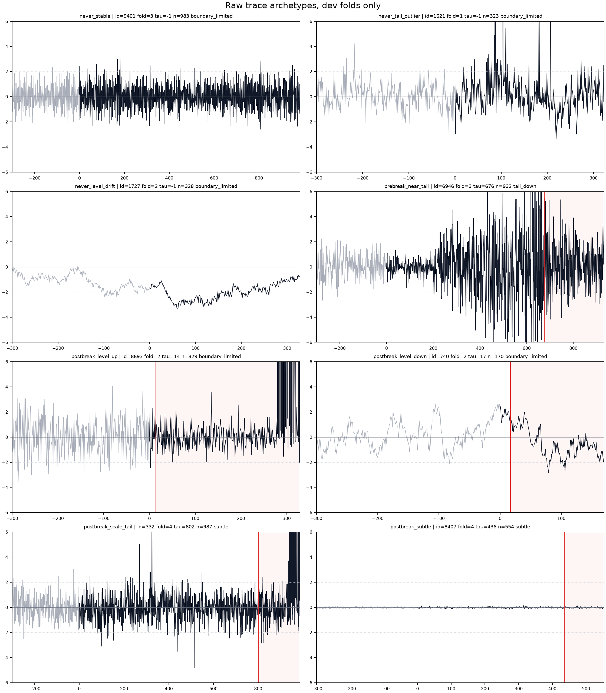
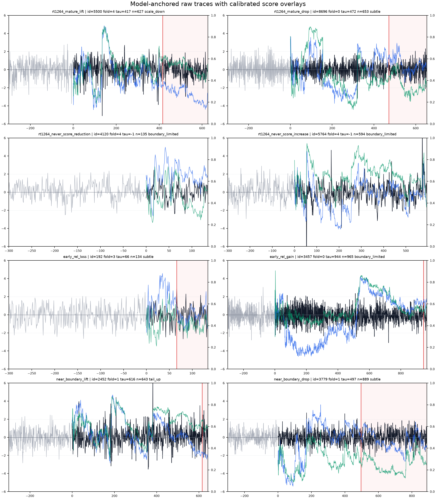
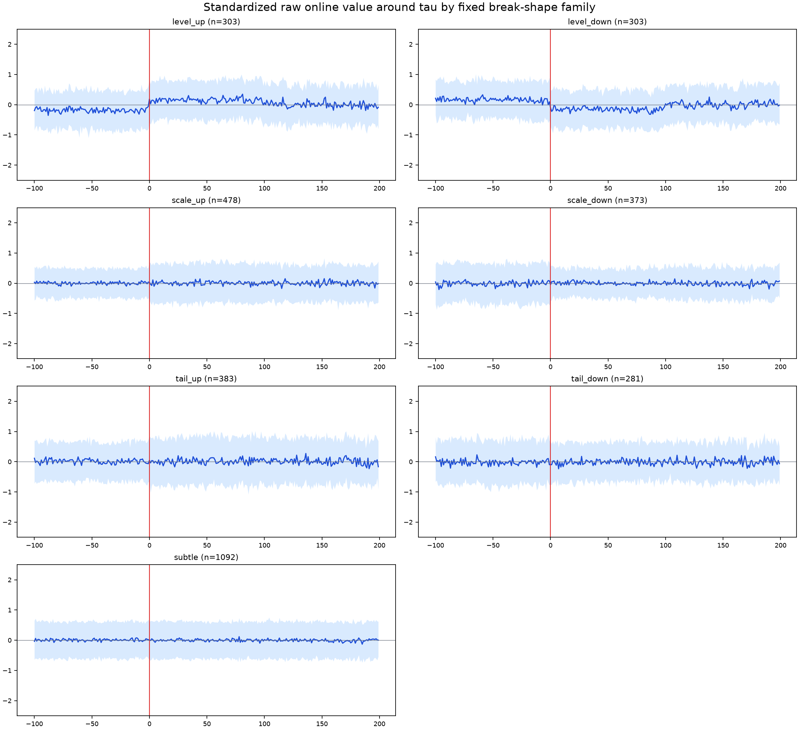
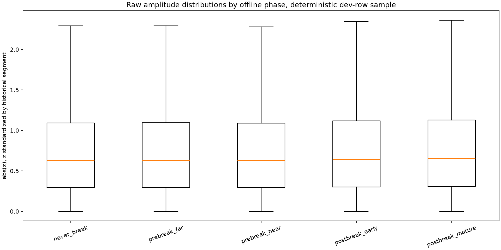
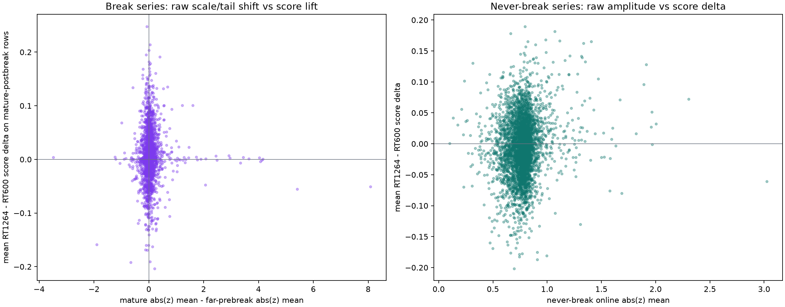

# RAW_DATA_ATLAS_2026 -- FINAL REPORT

Date: 2026-08-28
Branch: `research/raw-data-atlas-2026`
Analysis SHA: `d1ebb52`

## Scope

This atlas looks at the actual stored time-series values on dev folds only. It trains no model, writes no OOF vector, consumes no RT ID, appends no `RESULTS.csv` row, and does not summarize lockbox/test data.

## Figures

## Score Context

The fold-pure reconstruction used only existing OOF streams. RT600 mean TS-AUC is `0.625811342`; RT-1264 mean TS-AUC is `0.628189820`; delta is `+0.002378478`.

## Break Shape Families

| family | series | share | median level shift | median scale log | median tail2 shift | median mature score delta |
|---|---:|---:|---:|---:|---:|---:|
| `boundary_limited` | 762 | 0.1917 | 0.011612 | 0.020399 | 0.000000 | 0.005233 |
| `level_up` | 303 | 0.0762 | 0.305120 | 0.021993 | 0.000000 | 0.002295 |
| `level_down` | 303 | 0.0762 | -0.293973 | 0.020646 | 0.000000 | 0.002716 |
| `scale_up` | 478 | 0.1203 | -0.000216 | 0.316607 | 0.038592 | 0.009238 |
| `scale_down` | 373 | 0.0938 | 0.002828 | -0.308325 | -0.035224 | 0.002711 |
| `tail_up` | 383 | 0.0964 | 0.010254 | 0.164208 | 0.060000 | 0.005219 |
| `tail_down` | 281 | 0.0707 | -0.000918 | -0.139090 | -0.060000 | 0.003510 |
| `subtle` | 1092 | 0.2747 | -0.001868 | -0.000132 | 0.000000 | 0.002066 |

The raw break families are heterogeneous. Boundary-limited cases are common because many breaks happen close to the start or end of the online segment. Among well-windowed breaks, the largest families are level and scale/tail changes, but the `subtle` bucket is material: some labelled breaks have only weak local standardized-amplitude evidence around `tau`.

## Selected Series

| group | label | id | fold | tau | n_online | shape | online abs-z | mature delta | never delta |
|---|---|---:|---:|---:|---:|---|---:|---:|---:|
| `raw_archetype` | `never_stable` | 9401 | 3 | -1 | 983 | `boundary_limited` | 0.774954 |  | -0.087446 |
| `raw_archetype` | `never_tail_outlier` | 1621 | 1 | -1 | 323 | `boundary_limited` | 1.247597 |  | -0.042465 |
| `raw_archetype` | `never_level_drift` | 1727 | 2 | -1 | 328 | `boundary_limited` | 2.003592 |  | 0.032223 |
| `raw_archetype` | `prebreak_near_tail` | 6946 | 3 | 676 | 932 | `tail_down` | 1.538120 | -0.001990 |  |
| `raw_archetype` | `postbreak_level_up` | 8693 | 2 | 14 | 329 | `boundary_limited` | 358.599214 | -0.024587 |  |
| `raw_archetype` | `postbreak_level_down` | 740 | 2 | 17 | 170 | `boundary_limited` | 1.123625 | -0.037997 |  |
| `raw_archetype` | `postbreak_scale_tail` | 332 | 4 | 802 | 987 | `subtle` | 1.494064 | -0.050701 |  |
| `raw_archetype` | `postbreak_subtle` | 8407 | 4 | 436 | 554 | `subtle` | 0.036488 | -0.015066 |  |
| `model_anchored` | `rt1264_mature_lift` | 5500 | 4 | 417 | 627 | `scale_down` | 0.729532 | 0.247961 |  |
| `model_anchored` | `rt1264_mature_drop` | 8696 | 0 | 472 | 653 | `subtle` | 0.645452 | -0.203420 |  |
| `model_anchored` | `rt1264_never_score_reduction` | 4120 | 4 | -1 | 135 | `boundary_limited` | 0.695057 |  | -0.201515 |
| `model_anchored` | `rt1264_never_score_increase` | 5764 | 4 | -1 | 594 | `boundary_limited` | 0.795124 |  | 0.189657 |
| `model_anchored` | `early_rel_loss` | 192 | 3 | 66 | 134 | `subtle` | 0.798920 |  |  |
| `model_anchored` | `early_rel_gain` | 3457 | 0 | 944 | 965 | `boundary_limited` | 0.712434 |  |  |
| `model_anchored` | `near_boundary_lift` | 2452 | 1 | 616 | 643 | `tail_up` | 0.821312 |  |  |
| `model_anchored` | `near_boundary_drop` | 3779 | 1 | 497 | 889 | `subtle` | 0.583665 | -0.190945 |  |

The model-anchored examples make the same point as the numeric forensics: RT-1264's useful changes are not visually equivalent to a single raw threshold. Some large raw excursions are never-breaks; some true breaks are low-amplitude or delayed. The score overlays often separate regimes gradually rather than at an obvious point discontinuity.

A few extreme z-score examples are caused by very small historical scale in boundary-limited series. Treat those as calibration stress cases rather than representative break sizes.

## Raw Metric / Score Links

| diagnostic | series | Pearson | Spearman |
|---|---:|---:|---:|
| `break_post_scale_tail_vs_mature_score_delta` | 1926 | 0.001674 | 0.055498 |
| `break_level_shift_abs_vs_mature_score_delta` | 2709 | 0.013811 | 0.021707 |
| `break_tail2_shift_vs_mature_score_delta` | 2709 | 0.018339 | 0.046515 |
| `never_absz_mean_vs_score_delta` | 4025 | 0.128145 | 0.111643 |
| `never_tail3_rate_vs_score_delta` | 4025 | 0.100830 | 0.105057 |
| `early_rel_absz_vs_early_score_delta` | 6988 | -0.020889 | 0.086756 |

The correlations are descriptive, not model-selection evidence. They are useful mainly for ruling out simplistic stories: raw amplitude and local tail metrics explain some visible regimes, but they are too weak and mixed to become standalone hand rules without a new preregistered experiment.

## Conclusion

- The data itself is not a clean step-change detection problem; labelled breaks include level, scale, tail, delayed, and subtle regimes.
- Never-break false positives can look like plausible shocks under raw historical z-scores.
- RT-1264's dev gain does not come from an obvious visual threshold; deployment review should focus on early-relative-position behavior and never-break high-score mass.
- This atlas authorizes no production, router, threshold, or feature change.
